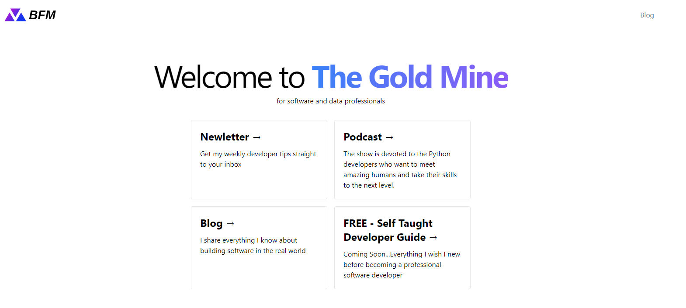

# Ben Franklyn McNeill Blog

## Live Demo

[https://https://benfranklynmcneill.com/](https://benfranklynmcneill.com/)

### Technologies used:

- [Netlify CMS](https://www.netlifycms.org/)
- [Eleventy](https://www.11ty.dev/)
- [Alpine.js](https://github.com/alpinejs/alpine)
- [Tailwind CSS](https://tailwindcss.com/)

|  |
| ------------------------ |

```
git clone https://github.com/bfmcneill/blog-benmcneill.git
```

### 2\. Navigate to the directory

```
cd blog-benmcneill
```

### 3\. Install dependencies

```
npm install
```

### 4\. Build the project to generate the first CSS

This step is only required the very first time.

```
npm run build
```

### 5\. Run Eleventy

```
npm run start
```

## Author

Ben McNeill ( [@bfmcneill](https://benfranklynmcneill.com) )
